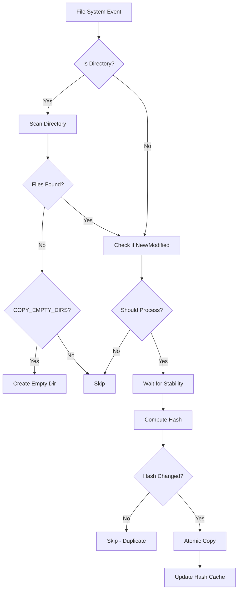

# 🗂️ Dropbox Consumer

<div align="center">
  
</div>

> **A robust file monitoring service for seamless document processing and file synchronization**

[](https://www.docker.com/)
[](https://www.python.org/)
[](https://creativecommons.org/licenses/by-nc/4.0/)

## 📋 Overview

Dropbox Consumer is a lightweight, Docker-based file monitoring service designed to intelligently watch source directories and safely process new files. While originally created to feed documents into [Paperless-NGX](https://docs.paperless-ngx.com/), it's a versatile solution that can be adapted for various file processing workflows including:

- 📄 **Document Management** - Automatic ingestion into Paperless-NGX, Nextcloud, or similar systems
- 🖼️ **Media Processing** - Photo/video organization and processing pipelines
- 📊 **Data Pipelines** - Automated processing of CSV, JSON, or other data files
- 🔄 **File Synchronization** - Intelligent copying between directories with deduplication
- 🏢 **Enterprise Workflows** - Automated document routing and processing
- 🎯 **Custom Processing** - Any scenario requiring reliable file monitoring and atomic operations

### ✨ Key Features

- 🔍 **Smart File Detection** - Only processes files created/modified after startup
- ⚡ **Real-time Monitoring** - Uses efficient file system event watching
- 🔒 **Atomic Operations** - Ensures Paperless never sees incomplete files
- 🛡️ **Duplicate Prevention** - SHA-256 hash comparison prevents redundant copying
- 📁 **Directory Structure Preservation** - Maintains folder organization
- 🔧 **Highly Configurable** - Extensive environment variable customization
- 📊 **Comprehensive Logging** - Detailed operation tracking and debugging

---

## 🚀 Quick Start

### Prerequisites

- Docker and Docker Compose
- Source directory with documents to monitor
- Destination directory for Paperless-NGX consumption

### Basic Setup

1. **Clone or download the project files**

2. **Configure your paths in `docker-compose.yml`:**
   ```yaml
   volumes:
     - /your/source/path:/source:ro          # Your document dropbox
     - /your/paperless/consume:/consume:rw   # Paperless consume directory
   ```

3. **Start the service:**
   ```bash
   docker-compose up -d
   ```

4. **Monitor logs:**
   ```bash
   docker-compose logs -f dropbox_consumer
   ```

That's it! Drop files into your source directory and watch them safely appear in Paperless.

---

## ⚙️ Configuration

### Environment Variables

| Variable | Default | Description |
|----------|---------|-------------|
| `SOURCE` | `/source` | Source directory to monitor |
| `DEST` | `/consume` | Destination directory (Paperless consume folder) |
| `RECURSIVE` | `true` | Monitor subdirectories recursively |
| `PRESERVE_DIRS` | `false` | Maintain directory structure in destination |
| `COPY_EMPTY_DIRS` | `false` | ⚠️ Copy empty directories (see warning below) |
| `DEBOUNCE_SECONDS` | `1.0` | Event debouncing delay |
| `STABILITY_INTERVAL` | `0.5` | File stability check interval |
| `STABILITY_STABLE_ROUNDS` | `2` | Consecutive stable checks required |
| `COPY_TIMEOUT` | `60` | Maximum time to wait for file stability |
| `MAX_WORKERS` | `4` | Maximum concurrent file processing threads |

### Docker Compose Example

```yaml
version: "3.8"
services:
  dropbox_consumer:
    image: trusmith/dropbox-consumer:latest
    container_name: dropbox_consumer
    user: "${PUID:-1000}:${PGID:-1000}"
    volumes:
      - /opt/documents/dropbox:/source:ro
      - /opt/paperless/consume:/consume:rw
    environment:
      - SOURCE=/source
      - DEST=/consume
      - PRESERVE_DIRS=true
      - RECURSIVE=true
      # WARNING: COPY_EMPTY_DIRS may create unnecessary directory structure
      - COPY_EMPTY_DIRS=false
      - DEBOUNCE_SECONDS=2.0
      - MAX_WORKERS=2
    restart: unless-stopped
```

### Directory Structure Preservation

When `PRESERVE_DIRS=true`, the service maintains your organizational structure:

```
Source:                    Destination:
📁 /source/               📁 /consume/
├── 📁 2024/             ├── 📁 2024/
│   ├── 📁 invoices/     │   ├── 📁 invoices/
│   │   └── 📄 inv1.pdf  │   │   └── 📄 inv1.pdf
│   └── 📁 receipts/     │   └── 📁 receipts/
│       └── 📄 rec1.pdf  │       └── 📄 rec1.pdf
```

### Empty Directory Handling

> ⚠️ **Warning**: `COPY_EMPTY_DIRS=true` may create unnecessary directory structure in your document management system. Only enable if you specifically need empty folder preservation.

```bash
# With COPY_EMPTY_DIRS=false (recommended)
mkdir -p documents/2024/january    # → No action (empty directories ignored)

# With COPY_EMPTY_DIRS=true
mkdir -p documents/2024/january    # → Creates /consume/documents/2024/january/
```

### File Stability Detection

The service waits for files to become stable before copying:

- Monitors file size changes
- Requires `STABILITY_STABLE_ROUNDS` consecutive unchanged size checks
- Prevents copying of files still being written
- Configurable timeout with `COPY_TIMEOUT`

### Intelligent Duplicate Prevention

- Computes SHA-256 hash of each file
- Skips copying if content hasn't changed since last copy
- Prevents unnecessary re-processing of identical files
- Maintains hash cache for efficient comparison

---

## 📊 Monitoring & Logging

### Log Levels

The service provides comprehensive logging with different verbosity levels:

```bash
# View all logs (DEBUG level enabled by default)
docker-compose logs -f dropbox_consumer

# Filter for specific events
docker-compose logs dropbox_consumer | grep "COPIED"
docker-compose logs dropbox_consumer | grep "ERROR"
```

### Sample Log Output

```
2024-09-18 17:34:32 [INFO] Starting file watcher.
2024-09-18 17:34:32 [INFO] SOURCE=/source DEST=/consume PRESERVE_DIRS=True RECURSIVE=True COPY_EMPTY_DIRS=False
2024-09-18 17:34:32 [INFO] Snapshot complete: 15 files recorded.
2024-09-18 17:34:32 [INFO] Observer started. (startup_time=2024-09-18 17:34:32)
2024-09-18 17:35:15 [INFO] EVENT -> CREATED ; candidate: /source/invoice_2024.pdf
2024-09-18 17:35:16 [INFO] COPIED -> /source/invoice_2024.pdf (size=245760 bytes, hash=a1b2c3...) to /consume/invoice_2024.pdf (took 0.021s)
```

### Key Log Events

| Log Type | Description |
|----------|-------------|
| `EVENT -> CREATED` | New file detected |
| `EVENT -> MODIFIED` | File modification detected |
| `COPIED ->` | Successful file copy with details |
| `Scanning new/modified directory` | Directory processing |
| `COPIED EMPTY DIR ->` | Empty directory copied (if enabled) |
| `Skipping (content identical)` | Duplicate prevention in action |

---

## 🛠️ Troubleshooting

### Common Issues

#### 1. Files Not Being Detected
```bash
# Check if source directory is properly mounted
docker-compose exec dropbox_consumer ls -la /source

# Verify file permissions
docker-compose exec dropbox_consumer ls -la /source/your-file.pdf
```

#### 2. Permission Errors
```bash
# Ensure PUID/PGID match your user
id    # Get your UID/GID
# Update docker-compose.yml with correct values
```

#### 3. Files Not Appearing in Paperless
```bash
# Check destination directory
docker-compose exec dropbox_consumer ls -la /consume

# Verify Paperless consume directory permissions
ls -la /your/paperless/consume/
```

#### 4. High CPU Usage
```bash
# Reduce worker threads
environment:
  - MAX_WORKERS=1

# Increase debounce time for high-frequency changes
environment:
  - DEBOUNCE_SECONDS=5.0
```

### Debug Mode

Enable verbose logging for troubleshooting:

```yaml
environment:
  - DEBOUNCE_SECONDS=0.1  # See events faster
  # Service runs with DEBUG logging by default
```

---

## 🏗️ Architecture

### How It Works

1. **Startup Snapshot**: Records existing files to avoid re-processing
2. **Event Monitoring**: Uses `watchdog` library for efficient file system monitoring
3. **Event Debouncing**: Prevents duplicate processing of rapid file changes
4. **Stability Checking**: Waits for files to stop changing before copying
5. **Hash Comparison**: Prevents duplicate copies of identical content
6. **Atomic Copy**: Uses temporary files + atomic rename for safe operations

### File Processing Flow



---

## 🤝 Contributing

Contributions are welcome! Please feel free to submit a Pull Request. For major changes, please open an issue first to discuss what you would like to change.

---

## 📄 License

This project is licensed under the Creative Commons Attribution-NonCommercial 4.0 International License - see the [LICENSE](LICENSE) file for details.

**In Summary:**
- ✅ **Personal Use**: Free to use, modify, and share
- ✅ **Attribution Required**: Must credit the original author
- ❌ **Commercial Use**: Not permitted without explicit permission
- 📧 **Commercial Inquiries**: Contact for licensing options

---

## 🙏 Acknowledgments

- Built for [Paperless-NGX](https://docs.paperless-ngx.com/) document management but adaptable for various file processing needs
- Uses [Watchdog](https://pythonhosted.org/watchdog/) for file system monitoring
- Inspired by the need for reliable, automated file processing workflows

---

<div align="center">

**Made with ❤️ for automated file processing workflows**

⭐ **Star this repo if it helped you automate your file processing!** ⭐

</div>