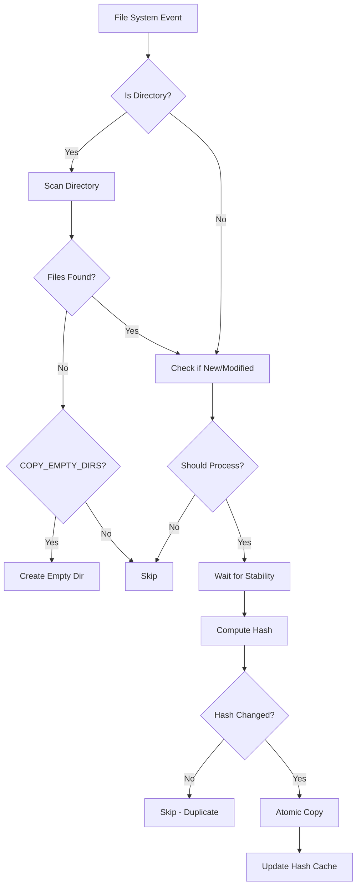

# 🗂️ Dropbox Consumer

<div align="center">
  
</div>

> **File monitoring service for document processing and synchronization**

[](https://www.docker.com/)
[](https://www.python.org/)
[](https://creativecommons.org/licenses/by-nc/4.0/)

## Overview

Monitors source directories and copies new files to destination. Originally designed for [Paperless-NGX](https://docs.paperless-ngx.com/) document ingestion.

**Use Cases:**
- Document management systems
- Media processing pipelines  
- Data file processing
- Directory synchronization

### Features

- Processes only new files (ignores existing on startup)
- Real-time file system monitoring
- Atomic file operations
- SHA-256 duplicate prevention
- Directory structure preservation
- Configurable via environment variables
- Docker log rotation

## Quick Start

**Prerequisites:** Docker and Docker Compose

1. **Configure paths in `docker-compose.yml`:**
   ```yaml
   volumes:
     - /your/source/path:/source:ro          # Your document dropbox
     - /your/paperless/consume:/consume:rw   # Paperless consume directory
   ```

3. **Start the service:**
   ```bash
   docker-compose up -d
   ```

4. **Monitor logs:**
   ```bash
   docker-compose logs -f dropbox_consumer
   ```

That's it! Drop files into your source directory and watch them safely appear in Paperless.

---

## ⚙️ Configuration

### Environment Variables

| Variable | Default | Description |
|----------|---------|-------------|
| `SOURCE` | `/source` | Source directory to monitor |
| `DEST` | `/consume` | Destination directory (Paperless consume folder) |
| `RECURSIVE` | `true` | Monitor subdirectories |
| `PRESERVE_DIRS` | `false` | Maintain directory structure |
| `COPY_EMPTY_DIRS` | `false` | Copy empty directories |
| `STATE_DIR` | `/app/state` | State persistence directory |
| `STATE_CLEANUP_DAYS` | `30` | Days to keep old state entries |
| `DEBOUNCE_SECONDS` | `1.0` | Event debouncing delay |
| `STABILITY_INTERVAL` | `0.5` | File stability check interval |
| `STABILITY_STABLE_ROUNDS` | `2` | Stable checks required |
| `COPY_TIMEOUT` | `60` | File stability timeout |
| `MAX_WORKERS` | `4` | Concurrent processing threads |
| `LOG_LEVEL` | `INFO` | Logging level |

### User and Permissions

| Variable | Default | Description |
|----------|---------|-------------|
| `PUID` | `1000` | Process User ID |
| `PGID` | `1000` | Process Group ID |

```bash
id $(whoami)
# Output example: uid=1000(username) gid=1000(groupname) groups=...
```

# Or individually:
echo "User ID: $(id -u)"
echo "Group ID: $(id -g)"
```

#### Permission Troubleshooting

If you encounter permission errors with state files or copied documents:

1. **Check ownership of directories:**
   ```bash
   ls -la /opt/dropbox-consumer/state
   ls -la /opt/paperless/consume
   ```

2. **Set correct PUID/PGID in docker-compose.yml:**
   ```yaml
   environment:
     - PUID=1000  # Replace with your user ID
     - PGID=1000  # Replace with your group ID
   ```

3. **For testing purposes, you can run as root (not recommended for production):**
   ```bash
   export PUID=0 PGID=0
   docker compose up
   ```

> 💡 **Tip**: The state directory (`/app/state`) must be writable by the container user for persistent storage to work correctly.

### Docker Compose Example

```yaml
version: "3.8"
services:
  dropbox_consumer:
    image: trusmith/dropbox-consumer:latest
    container_name: dropbox_consumer
    user: "${PUID:-1000}:${PGID:-1000}"
    volumes:
      - /opt/documents/dropbox:/source:ro
      - /opt/paperless/consume:/consume:rw
      # 🆕 Persistent state to prevent re-processing after restarts
      - ./state:/app/state:rw
    environment:
      - SOURCE=/source
      - DEST=/consume
      - PRESERVE_DIRS=true
      - RECURSIVE=true
      # WARNING: COPY_EMPTY_DIRS may create unnecessary directory structure
      - COPY_EMPTY_DIRS=false
      # 🆕 Persistent state configuration
      - STATE_DIR=/app/state
      - STATE_CLEANUP_DAYS=30
      # 🆕 Docker-native logging with automatic rotation
      - LOG_LEVEL=INFO
      - DEBOUNCE_SECONDS=2.0
      - MAX_WORKERS=2
    restart: unless-stopped
```

### Directory Structure Preservation

When `PRESERVE_DIRS=true`, the service maintains your organizational structure:

```
Source:                    Destination:
📁 /source/               📁 /consume/
├── 📁 2024/             ├── 📁 2024/
│   ├── 📁 invoices/     │   ├── 📁 invoices/
│   │   └── 📄 inv1.pdf  │   │   └── 📄 inv1.pdf
│   └── 📁 receipts/     │   └── 📁 receipts/
│       └── 📄 rec1.pdf  │       └── 📄 rec1.pdf
```

### Empty Directory Handling

> ⚠️ **Warning**: `COPY_EMPTY_DIRS=true` may create unnecessary directory structure in your document management system. Only enable if you specifically need empty folder preservation.

```bash
# With COPY_EMPTY_DIRS=false (recommended)
mkdir -p documents/2024/january    # → No action (empty directories ignored)

# With COPY_EMPTY_DIRS=true
mkdir -p documents/2024/january    # → Creates /consume/documents/2024/january/
```

### File Stability Detection

The service waits for files to become stable before copying:

- Monitors file size changes
- Requires `STABILITY_STABLE_ROUNDS` consecutive unchanged size checks
- Prevents copying of files still being written
- Configurable timeout with `COPY_TIMEOUT`

### Docker-native Logging

Available log levels: DEBUG, INFO, WARNING, ERROR, CRITICAL

```yaml
environment:
  - LOG_LEVEL=INFO
logging:
  driver: "json-file"
  options:
    max-size: "10m"
    max-file: "3"
```

### Duplicate Prevention

- SHA-256 hash comparison
- Persistent hash cache across restarts
- Automatic cache cleanup

### State Management

- Maintains processing history across restarts
- Configurable retention
- JSON storage for debugging

## Monitoring & Logging

```bash
# View logs
docker-compose logs -f dropbox_consumer

# Filter events
docker-compose logs dropbox_consumer | grep "COPIED"
docker-compose logs dropbox_consumer | grep "ERROR"
```

### Sample Log Output

```
2024-09-18 17:34:32 [INFO] Starting file watcher.
2024-09-18 17:34:32 [INFO] SOURCE=/source DEST=/consume PRESERVE_DIRS=True RECURSIVE=True COPY_EMPTY_DIRS=False
2024-09-18 17:34:32 [INFO] Snapshot complete: 15 files recorded.
2024-09-18 17:34:32 [INFO] Observer started. (startup_time=2024-09-18 17:34:32)
2024-09-18 17:35:15 [INFO] EVENT -> CREATED ; candidate: /source/invoice_2024.pdf
2024-09-18 17:35:16 [INFO] COPIED -> /source/invoice_2024.pdf (size=245760 bytes, hash=a1b2c3...) to /consume/invoice_2024.pdf (took 0.021s)
```

### Key Log Events

| Log Type | Description |
|----------|-------------|
| `EVENT -> CREATED` | New file detected |
| `EVENT -> MODIFIED` | File modification detected |
| `COPIED ->` | Successful file copy with details |
| `Scanning new/modified directory` | Directory processing |
| `COPIED EMPTY DIR ->` | Empty directory copied (if enabled) |
| `Skipping (content identical)` | Duplicate prevention in action |

---

## 🛠️ Troubleshooting

### Common Issues

#### 1. Files Not Being Detected
```bash
# Check if source directory is properly mounted
docker-compose exec dropbox_consumer ls -la /source

# Verify file permissions
docker-compose exec dropbox_consumer ls -la /source/your-file.pdf
```

#### 2. Permission Errors
```bash
# Ensure PUID/PGID match your user
id    # Get your UID/GID
# Update docker-compose.yml with correct values
```

#### 3. Files Not Appearing in Paperless
```bash
# Check destination directory
docker-compose exec dropbox_consumer ls -la /consume

# Verify Paperless consume directory permissions
ls -la /your/paperless/consume/
```

#### 4. State Persistence Issues
```bash
# Check if state directory exists and is writable
ls -la ./state/
docker-compose exec dropbox_consumer ls -la /app/state

# Verify state files are being created
ls -la ./state/*.json

# Check container logs for state-related errors
docker-compose logs | grep -i state

# If state directory is not writable, check PUID/PGID settings
docker-compose exec dropbox_consumer id
```

#### 5. High CPU Usage
```bash
# Reduce worker threads
environment:
  - MAX_WORKERS=1

# Increase debounce time for high-frequency changes
environment:
  - DEBOUNCE_SECONDS=5.0
```

#### 5. State Persistence Issues
```bash
# Check state directory permissions
docker-compose exec dropbox_consumer ls -la /app/state

# Verify state files are being created
docker-compose exec dropbox_consumer ls -la /app/state/

# Reset state (removes processing history)
sudo rm -rf /opt/dropbox-consumer/state/*
docker-compose restart dropbox_consumer
```

#### 6. Files Being Re-processed After Restart
```bash
# Ensure state volume is properly mounted
docker-compose exec dropbox_consumer ls -la /app/state/

# Check state directory has correct permissions
sudo chown -R $(id -u):$(id -g) /opt/dropbox-consumer/state/
```

### Debug Mode

Enable verbose logging for troubleshooting:

```yaml
environment:
  - DEBOUNCE_SECONDS=0.1  # See events faster
  # Service runs with DEBUG logging by default
```

---

## 🏗️ Architecture

### How It Works

1. **Startup Snapshot**: Records existing files to avoid re-processing
2. **Event Monitoring**: Uses `watchdog` library for efficient file system monitoring
3. **Event Debouncing**: Prevents duplicate processing of rapid file changes
4. **Stability Checking**: Waits for files to stop changing before copying
5. **Hash Comparison**: Prevents duplicate copies of identical content
6. **Atomic Copy**: Uses temporary files + atomic rename for safe operations

### File Processing Flow



---

## 🤝 Contributing

Contributions are welcome! Please feel free to submit a Pull Request. For major changes, please open an issue first to discuss what you would like to change.

---

## 📄 License

This project is licensed under the Creative Commons Attribution-NonCommercial 4.0 International License - see the [LICENSE](LICENSE) file for details.

**In Summary:**
- ✅ **Personal Use**: Free to use, modify, and share
- ✅ **Attribution Required**: Must credit the original author
- ❌ **Commercial Use**: Not permitted without explicit permission
- 📧 **Commercial Inquiries**: Contact for licensing options

---

## 🙏 Acknowledgments

- Built for [Paperless-NGX](https://docs.paperless-ngx.com/) document management but adaptable for various file processing needs
- Uses [Watchdog](https://pythonhosted.org/watchdog/) for file system monitoring
- Inspired by the need for reliable, automated file processing workflows

---

<div align="center">

**Made with ❤️ for automated file processing workflows**

⭐ **Star this repo if it helped you automate your file processing!** ⭐

</div>